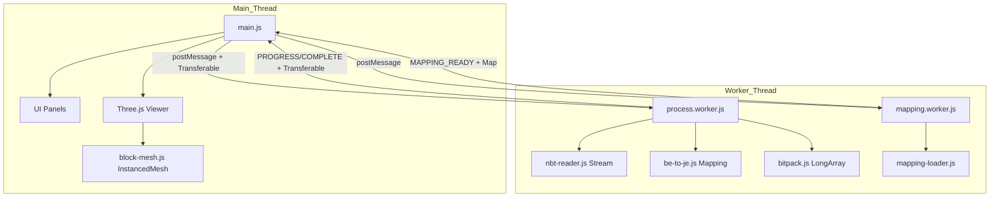

# Minecraft Structure Planner — Master Design Guideline (v2.1)

> **AI Instruction**: This document is the project's "Constitution." It covers the vision, feature roadmap (PRD), detailed modular design, and prompt templates to minimize hallucinations. v2.1 adds concrete architecture definitions, type interfaces, and a landmine map derived from primary source analysis.

---

## 1. Project Overview

### 1-1. Project Essence
This tool is a **Back-office Compiler for hacking Minecraft's data structures** in Survival gameplay. It eliminates the three pain points of large-scale builds: material calculation, scaffolding placement, and spawn-proofing — all automatically.

| Category | Feature |
| :--- | :--- |
| **Viewing** | 3D structure preview with HD/Faithful texture support |
| **Export / Conversion** | Bedrock `.mcstructure` → Java `.litematic` full conversion |
| **Data Manipulation** | Spawn-proofing automation, scaffold generation, inversion (excavation guide) |
| **Workflow Support** | Multi-structure merging, quad-split optimization, part-based workflow |

### 1-2. Target Environment Assumptions
- **Survival End-game**: Execution efficiency over material cost.
- **Hologram Environment**: OderSo / Schematica addons for in-game projection.
- **Technical Stack**: Vanilla JS + Three.js r128 + Web Workers + Vite.
- **File Name Constraint**: No spaces in output filenames (OderSo addon limitation).

---

## 2. Architecture: Three Core Principles (Non-Negotiable)

Every module must adhere to these three principles:

### Principle 1: Stream Pipeline Processing
**Never** deserialize an entire NBT file into a nested JS object tree.
Process in virtual `16×16×16` sections using `Uint16Array` and `DataView` direct binary reads. Discard each section after processing.

### Principle 2: Strict Worker Isolation
Main thread = DOM rendering + lightweight Three.js preview **only**.
All NBT parsing, binary writing, ID conversion, and bit-packing must run in Web Workers. Cross-thread communication via `Transferable Objects` (zero-copy).

### Principle 3: Data-Driven Mapping
Never hardcode block ID translation in JS. Fetch `be_to_je_block_mapping.json` (sourced from GeyserMC/mappings), build a `Map<string, JavaBlockState>` in the mapping worker, and resolve lookups in O(1).

---

## 3. Refactoring Design: Modular File Structure

### 3-1. Directory Tree (v2.1)

```
project/
├── index.html
├── vite.config.js
└── js/
    ├── main.js                      # Entry point — thin glue for UI ↔ Worker only
    ├── ui/
    │   ├── panels/
    │   │   ├── viewer-panel.js
    │   │   ├── materials-panel.js
    │   │   └── dotart-panel.js
    │   └── components/
    │       ├── toast.js
    │       ├── modal.js
    │       └── progress.js
    ├── render/
    │   ├── viewer3d.js              # Three.js preview coordinator
    │   ├── scene.js                 # Scene / Camera / Light management
    │   └── block-mesh.js            # InstancedMesh + culling
    ├── workers/
    │   ├── process.worker.js        # Heavy processing pipeline
    │   └── mapping.worker.js        # Mapping data load & lookup
    └── modules/                     # Pure logic — importable in both threads
        ├── stream/
        │   ├── nbt-reader.js        # DataView-based streaming reader (LE + BE)
        │   └── nbt-writer.js        # Big-Endian NBT writer (Java output)
        ├── mapping/
        │   ├── be-to-je.js          # Bedrock→Java conversion (Map lookup)
        │   └── mapping-loader.js    # JSON fetch + Map<string,JavaBlockState> builder
        └── logic/
            ├── merge.js             # Coordinate merge & negative offset handling
            ├── scaffold.js          # Scaffolding optimization engine
            ├── invert.js            # Excavation guide (Invert) generation
            ├── light-patch.js       # Hidden light source patching
            └── bitpack.js           # Litematic LongArray bit-packing (BigInt64Array)
```

### 3-2. Architecture Diagram



---

## 4. Worker Communication Interface

```typescript
// Main → Worker request
interface WorkerTask {
    type: 'PARSE_NBT' | 'CONVERT_LITEMATIC' | 'MERGE_STRUCTURES' |
          'SCAFFOLD_GEN' | 'INVERT_GEN' | 'LOAD_MAPPING';
    taskId: string;
    payload: {
        buffer?: ArrayBuffer;   // Transferable
        config?: {
            sourceFormat: 'mcstructure' | 'nbt';
            targetFormat: 'litematic' | 'mcstructure';
            minecraftDataVersion?: number;
        };
    };
}

// Worker → Main response
interface WorkerResponse {
    type: 'PROGRESS' | 'COMPLETE' | 'ERROR';
    taskId: string;
    payload: {
        progress?: number;      // 0.0 – 1.0
        stage?: string;
        data?: ArrayBuffer;     // Transferable
        metadata?: {
            blockCount: number;
            paletteSize: number;
            dimensions: [number, number, number];
            warnings?: string[];
        };
        error?: string;
    };
}
```

---

## 5. Feature Roadmap (Phases 1–5)

### Phase 1: Foundation & Refactoring
- **1-1** `app.js` complete modular split (highest priority ⭐)
- **1-2** HD texture UV fix (Faithful 32×32 — dynamic `texture.image.width` scaling)
- **1-3** BYOP (Bring Your Own Pack) — in-memory pack overlay system

### Phase 2: Export & Conversion (Data Hack Layer)
- **2-1** Java `.litematic` full conversion output
  - `nbt-writer.js` (Big-Endian NBT)
  - `be-to-je.js` (GeyserMC-based block state mapping)
  - `bitpack.js` (1.16+ no-wrap LongArray packing)
- **2-2** Multi-structure merge + deduplication (duplicate coordinate cleanup)
- **2-3** Quad-split optimization + placement guide coordinate sheet

### Phase 3: Survival Automation Engine
- **3-1** Scaffolding optimization (4.5-block reach sphere + 6-block stability limit)
- **3-2** Hollow-out (Haribote) optimization — replace hidden interior blocks
- **3-3** Spawn-proofing heatmap (light level 0 shader visualization + hidden light patch)

### Phase 4: Logistics & Analytics
- **4-1** Full crafting tree + fuel calculator (reverse-compute raw materials)
- **4-2** Shulker box packing visualizer (27-slot UI)
- **4-3** Mobile optimization / PWA (offline operation + Field Mode checklist UI)

### Phase 5: Creator Tools
- **5-1** 3D model (.obj / .stl) auto-voxelization → `.mcstructure` output
- **5-2** Dot-art coordinate grid overlay (5×5 grid background)
- **5-3** IKEA-style step-by-step build guide (PDF / image sequence export)

---

## 6. AI Prompt Template Collection

### Template 01: NBT Stream Reader
```markdown
## Scope
Create `js/modules/stream/nbt-reader.js` — a DataView-based streaming NBT reader.
- Constructor flag `littleEndian: boolean` (true=Bedrock, false=Java).
- Strip the 8-byte Bedrock header automatically when format='bedrock'.
- Expose a cursor-based API: `readTag(cursor) → { type, name, value, nextCursor }`
- Use a generator `function* readCompound(buffer, offset, le)` yielding tag metadata
  WITHOUT materializing full nested objects.
```

### Template 02: NBT Writer (Big-Endian / Java)
```markdown
## Scope
Create `js/modules/stream/nbt-writer.js` for Java-compatible Big-Endian NBT output.
- Use BigInt for writeLong and writeLongArray.
- Support: TAG_Compound, TAG_List, TAG_LongArray, TAG_String, TAG_Int, TAG_Byte, TAG_Short.
- Output a single ArrayBuffer. No DOM or Node.js APIs.
```

### Template 03: Litematic Bit-packing (1.16+)
```markdown
## Scope
Implement `js/modules/logic/bitpack.js`:
- packBlockStates(indices, paletteSize) → BigInt64Array
- unpackBlockStates(longs, totalBlocks, paletteSize) → Uint16Array
- STRICTLY follow the no-wrap rule: entriesPerLong = Math.floor(64 / bitsPerEntry).
- Include a round-trip unit test: palette=16, 4096 indices, verify exact recovery.
```

### Template 04: Bedrock → Java Conversion Pipeline
```markdown
## Scope
Implement the full conversion pipeline in workers/process.worker.js:
1. Read .mcstructure via nbt-reader.js (cursor-based, section-by-section, 16^3).
2. Convert each section's palette entries via be-to-je.js (Map lookup).
3. Pack converted indices into Litematic LongArray via bitpack.js.
4. Emit PROGRESS every section. Transfer final ArrayBuffer via Transferable.
- Do NOT build intermediate JS objects larger than one 16^3 section at a time.
```

---

## 7. Hallucination Prevention Checklist

### Binary Operations
- **Bedrock NBT 8-byte header**: Strip on read, write on output.
- **Endianness**: Never omit the `DataView` boolean. `true`=LE(Bedrock), `false`=BE(Java).
- **ZYX vs YZX**: Bedrock=`SZ*SY*X + SZ*Y + Z`. Litematic=`y*|sz|*|sx| + z*|sx| + x`.
- **LongArray**: Use `BigInt64Array`. `Number` has only 53-bit precision — Longs will corrupt.
- **Bit-packing**: `Math.floor(64/bitsPerEntry)` — floor only, never ceil.

### Mapping
- **The Flattening**: One Bedrock name → multiple Java names based on `states`. Key = `name|sortedStates`.
- **Waterlogging**: Bedrock layer 1 ≠ -1 → Java `waterlogged:"true"`.
- **Boolean types**: Bedrock=`TAG_Byte(0/1)`, Java=`String("true"/"false")`.

### Three.js r128
- `OrbitControls` is NOT on the `THREE` object — import separately.
- `CapsuleGeometry` does not exist — use `CylinderGeometry` + `SphereGeometry`.
- After `InstancedMesh.setMatrixAt()`, set `instanceMatrix.needsUpdate = true`.

### File Output
- Filename: no spaces (OderSo constraint). Validate with `/\s/.test(name)` before writing.
- Litematic: must be GZip-compressed. Use `pako.gzip()` or `CompressionStream('gzip')`.

---
*Last Updated: 2026-05-13 (v2.1 — Architecture Precision Upgrade)*
